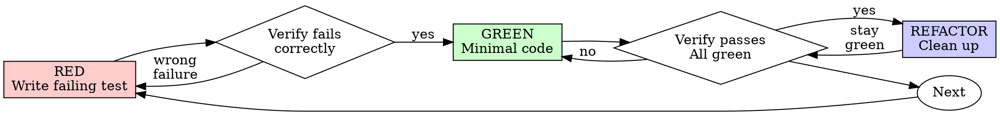

# Test-Driven Development (TDD)

## Overview

Write the test first. Watch it fail. Write minimal code to pass.

**Core principle:** If you didn't watch the test fail, you don't know if it tests the right thing.

**Violating the letter of the rules is violating the spirit of the rules.**

## When to Use

**Always:**

- New features
- Bug fixes
- Refactoring
- Behavior changes

**Exceptions (ask your human partner):**

- Throwaway prototypes
- Generated code
- Configuration files

Thinking "skip TDD just this once"? Stop. That's rationalization.

## Before Writing Tests

Before starting the TDD cycle, understand the terrain. This preparation enables better tests.

### 1. Read the Code Under Test

```bash
# Read the module you're about to test
```

Understand:

- The module's responsibilities and dependencies
- Edge cases and error conditions to cover
- Existing patterns and abstractions
- Input/output types and interfaces

### 2. Review Existing Test Patterns

```bash
# Find test files in the same area
ls -la path/to/module/__tests__/
# or
ls -la path/to/module/*.test.ts
```

Look for:

- **Factories** - `createUser()`, `buildOrder()` - reusable object builders
- **Fixtures** - Static test data, sample payloads, mock responses
- **Custom matchers** - `expect(x).toBeValidEmail()`
- **Setup utilities** - `withTestDatabase()`, `mockAuthenticatedUser()`
- **Naming conventions** - How tests are named and organized
- **Assertion style** - Which matchers are preferred

### 3. Decide: Reuse, Create, or Inline

| Situation                      | Action                                        |
| ------------------------------ | --------------------------------------------- |
| Factory/fixture exists         | Use it                                        |
| Pattern will repeat 2+ times   | Create reusable utility in test-utils         |
| One-off test data              | Inline in test                                |
| Complex object with many tests | Create factory after second test needs it     |

**Extract on repetition, not speculation.** Write the first test inline. If a second test needs the same setup, extract a factory. Premature abstraction obscures intent.

### 4. Understand Types

Before writing tests, know the types you're working with:

```typescript
// Read the interface/type definitions
interface CreateUserInput {
  email: string;
  name: string;
  role?: 'admin' | 'user';
}
```

This informs what your test data should look like and what edge cases exist.

## The Iron Law

```
NO PRODUCTION CODE WITHOUT A FAILING TEST FIRST
```

Write code before the test? Delete it. Start over.

**Follow these principles:**

- Implement fresh from tests
- Throw away any "reference" code
- Start clean, let tests drive the design

## Red-Green-Refactor



### RED - Write Failing Test

Write one minimal test showing what should happen.

<Good>

```typescript
test('retries failed operations 3 times', async () => {
  let attempts = 0;
  const operation = () => {
    attempts++;
    if (attempts < 3) throw new Error('fail');
    return 'success';
  };

  const result = await retryOperation(operation);

  expect(result).toBe('success');
  expect(attempts).toBe(3);
});
```

Clear name, tests real behavior, one thing
</Good>

<Bad>

```typescript
test('retry works', async () => {
  const mock = jest.fn()
    .mockRejectedValueOnce(new Error())
    .mockRejectedValueOnce(new Error())
    .mockResolvedValueOnce('success');
  await retryOperation(mock);
  expect(mock).toHaveBeenCalledTimes(3);
});
```

Vague name, tests mock not code
</Bad>

**Requirements:**

- One behavior
- Clear name
- Real code (no mocks unless unavoidable)

### Verify RED - Watch It Fail

**MANDATORY. This step proves your test works.**

```bash
pnpm test path/to/test.test.ts
```

Confirm:

- Test fails (not errors)
- Failure message is expected
- Fails because feature missing (not typos)

**Test passes?** You're testing existing behavior. Fix test.

**Test errors?** Fix error, re-run until it fails correctly.

### GREEN - Minimal Code

Write the simplest **general** implementation to pass the test.

**Minimal ≠ Hard-coded.** "Simplest code to pass" means the simplest working implementation, not values that only work for test inputs.

<Good>

```typescript
async function retryOperation<T>(fn: () => Promise<T>): Promise<T> {
  for (let i = 0; i < 3; i++) {
    try {
      return await fn();
    } catch (e) {
      if (i === 2) throw e;
    }
  }
  throw new Error('unreachable');
}
```

Just enough to pass - implements actual logic
</Good>

<Bad>

```typescript
// Hard-coded to pass test
async function retryOperation<T>(fn: () => Promise<T>): Promise<T> {
  await fn().catch(() => {});
  await fn().catch(() => {});
  return fn(); // Only works because test retries exactly 3 times
}
```

Hard-coded - will break with different inputs
</Bad>

<Bad>

```typescript
async function retryOperation<T>(
  fn: () => Promise<T>,
  options?: {
    maxRetries?: number;
    backoff?: 'linear' | 'exponential';
    onRetry?: (attempt: number) => void;
  }
): Promise<T> {
  // YAGNI - no test requires these options yet
}
```

Over-engineered - features without tests
</Bad>

Focus on the current test. Add features when tests require them.

### Verify GREEN - Watch It Pass

**MANDATORY.**

```bash
pnpm test path/to/test.test.ts
```

Confirm:

- Test passes
- Other tests still pass
- Output pristine (no errors, warnings)

**Test fails?** Fix code, not test.

**Other tests fail?** Fix now.

### REFACTOR - Clean Up

After green only:

- Remove duplication
- Improve names
- Extract helpers (when patterns repeat)

Keep tests green. Add no new behavior.

### Repeat

Next failing test for next feature.

## Type Safety in Tests

Tests must use proper types. Weak typing hides bugs and defeats the purpose of TypeScript.

### Use Real Types

<Good>

```typescript
test('creates user with valid input', async () => {
  const input: CreateUserInput = {
    email: 'test@example.com',
    name: 'Test User',
  };

  const result = await createUser(input);

  expect(result.id).toBeDefined();
  expect(result.email).toBe(input.email);
});
```

Typed input - compiler catches mistakes
</Good>

<Bad>

```typescript
test('creates user with valid input', async () => {
  const input: any = {
    email: 'test@example.com',
    name: 'Test User',
  };

  const result = await createUser(input);

  expect(result.id).toBeDefined();
});
```

`any` hides type errors - test could pass with wrong shape
</Bad>

### Type Rules

| Situation                    | Approach                                        |
| ---------------------------- | ----------------------------------------------- |
| Test data                    | Use the actual interface/type                   |
| Factory return types         | Explicitly type the return                      |
| Mock return values           | Type them to match the real function's return   |
| Partial test data            | Use `Partial<T>` or pick specific fields        |
| Testing error cases          | Still type the valid fields                     |

### Why This Matters

- **Catches refactoring breaks** - Rename a field? Tests fail to compile.
- **Documents expectations** - Types show what shape data should have.
- **Prevents false positives** - `any` lets wrong data through silently.
- **Matches production** - Production code is typed; tests should be too.

```typescript
// When testing partial scenarios, be explicit
test('rejects user without email', async () => {
  const input: Omit<CreateUserInput, 'email'> = {
    name: 'Test User',
  };

  // @ts-expect-error - intentionally testing missing required field
  await expect(createUser(input)).rejects.toThrow('Email required');
});
```

Use `@ts-expect-error` when intentionally passing invalid types to test error handling.

## Good Tests

| Quality          | Good                                | Bad                                                 |
| ---------------- | ----------------------------------- | --------------------------------------------------- |
| **Minimal**      | One thing. "and" in name? Split it. | `test('validates email and domain and whitespace')` |
| **Clear**        | Name describes behavior             | `test('test1')`                                     |
| **Shows intent** | Demonstrates desired API            | Obscures what code should do                        |
| **Typed**        | Uses real interfaces                | Uses `any` or untyped objects                       |

## Verification Checklist

Before marking work complete:

- [ ] Read existing code and test patterns before writing tests
- [ ] Every new function/method has a test
- [ ] Watched each test fail before implementing
- [ ] Each test failed for expected reason (feature missing, not typo)
- [ ] Wrote minimal **general** code to pass (no hard-coding)
- [ ] All tests pass
- [ ] Output pristine (no errors, warnings)
- [ ] Tests use real code (mocks only if unavoidable)
- [ ] Tests use proper types (no `any`)
- [ ] Edge cases and errors covered
- [ ] Reused existing factories/fixtures where available
- [ ] Extracted new utilities only when patterns repeated

Can't check all boxes? You skipped TDD. Start over.

## Why Order Matters

**"I'll write tests after to verify it works"**

Tests written after code pass immediately. Passing immediately proves nothing:

- Might test wrong thing
- Might test implementation, not behavior
- Might miss edge cases you forgot
- You never saw it catch the bug

Test-first forces you to see the test fail, proving it actually tests something.

**"I already manually tested all the edge cases"**

Manual testing is ad-hoc. You think you tested everything but:

- No record of what you tested
- Can't re-run when code changes
- Easy to forget cases under pressure
- "It worked when I tried it" ≠ comprehensive

Automated tests are systematic. They run the same way every time.

**"Deleting X hours of work is wasteful"**

Sunk cost fallacy. The time is already gone. Your choice now:

- Delete and rewrite with TDD (X more hours, high confidence)
- Keep it and add tests after (30 min, low confidence, likely bugs)

The "waste" is keeping code you can't trust. Working code without real tests is technical debt.

**"TDD is dogmatic, being pragmatic means adapting"**

TDD IS pragmatic:

- Finds bugs before commit (faster than debugging after)
- Prevents regressions (tests catch breaks immediately)
- Documents behavior (tests show how to use code)
- Enables refactoring (change freely, tests catch breaks)

"Pragmatic" shortcuts = debugging in production = slower.

**"Tests after achieve the same goals - it's spirit not ritual"**

No. Tests-after answer "What does this do?" Tests-first answer "What should this do?"

Tests-after are biased by your implementation. You test what you built, not what's required. You verify remembered edge
cases, not discovered ones.

Tests-first force edge case discovery before implementing. Tests-after verify you remembered everything (you didn't).

30 minutes of tests after ≠ TDD. You get coverage, lose proof tests work.

## Common Rationalizations

| Excuse                                 | Reality                                                                 |
| -------------------------------------- | ----------------------------------------------------------------------- |
| "Too simple to test"                   | Simple code breaks. Test takes 30 seconds.                              |
| "I'll test after"                      | Tests passing immediately prove nothing.                                |
| "Tests after achieve same goals"       | Tests-after = "what does this do?" Tests-first = "what should this do?" |
| "Already manually tested"              | Ad-hoc ≠ systematic. No record, can't re-run.                           |
| "Deleting X hours is wasteful"         | Sunk cost fallacy. Keeping unverified code is technical debt.           |
| "Keep as reference, write tests first" | You'll adapt it. That's testing after. Delete means delete.             |
| "Need to explore first"                | Fine. Throw away exploration, start with TDD.                           |
| "Test hard = design unclear"           | Listen to test. Hard to test = hard to use.                             |
| "TDD will slow me down"                | TDD faster than debugging. Pragmatic = test-first.                      |
| "Manual test faster"                   | Manual doesn't prove edge cases. You'll re-test every change.           |
| "Existing code has no tests"           | You're improving it. Add tests for existing code.                       |

## Red Flags - STOP and Start Over

- Code before test
- Test after implementation
- Test passes immediately
- Can't explain why test failed
- Tests added "later"
- Rationalizing "just this once"
- "I already manually tested it"
- "Tests after achieve the same purpose"
- "It's about spirit not ritual"
- "Keep as reference" or "adapt existing code"
- "Already spent X hours, deleting is wasteful"
- "TDD is dogmatic, I'm being pragmatic"
- "This is different because..."
- Using `any` to avoid typing test data
- Hard-coding values to pass specific test cases

**All of these mean: Delete code. Start over with TDD.**

## Example: Bug Fix

**Bug:** Empty email accepted

**Phase 0: Understand the code**

```bash
# Read the form submission code
# Check for existing validation tests
# Look for validation utilities
```

**RED**

```typescript
test('rejects empty email', async () => {
  const result = await submitForm({ email: '' });
  expect(result.error).toBe('Email required');
});
```

**Verify RED**

```bash
$ pnpm test
FAIL: expected 'Email required', got undefined
```

**GREEN**

```typescript
function submitForm(data: FormData) {
  if (!data.email?.trim()) {
    return { error: 'Email required' };
  }
  // ...
}
```

**Verify GREEN**

```bash
$ pnpm test
PASS
```

**REFACTOR** Extract validation for multiple fields if needed.

## When Stuck

| Problem                | Solution                                                             |
| ---------------------- | -------------------------------------------------------------------- |
| Don't know how to test | Write wished-for API. Write assertion first. Ask your human partner. |
| Test too complicated   | Design too complicated. Simplify interface.                          |
| Must mock everything   | Code too coupled. Use dependency injection.                          |
| Test setup huge        | Extract helpers. Still complex? Simplify design.                     |
| Need factories         | Write inline first, extract when pattern repeats.                    |

## Debugging Integration

Bug found? Write failing test reproducing it. Follow TDD cycle. Test proves fix and prevents regression.

Fix bugs with a test. The test documents the bug and prevents regression.

## Testing Anti-Patterns

When adding mocks or test utilities, read [testing-anti-patterns.md](./testing-anti-patterns.md) to avoid common pitfalls:

- Testing mock behavior instead of real behavior
- Adding test-only methods to production classes
- Mocking without understanding dependencies

## Final Rule

```
Production code → test exists and failed first
Otherwise → not TDD
```

Follow these principles without exception. Ask your human partner if genuinely uncertain.
